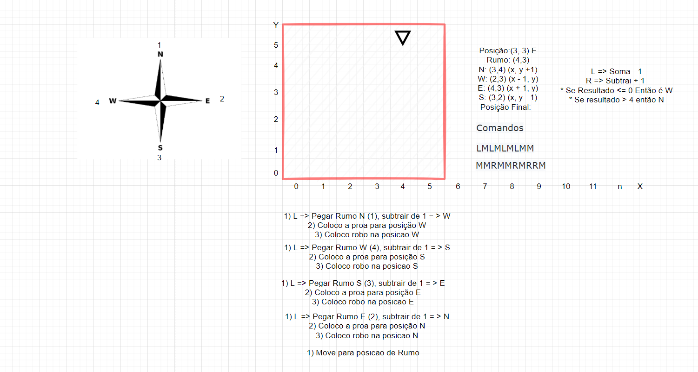

# Nasa Explorer

## Requisitos <a name="requisitos"></a>

- Requer .NET Core 5

## ☕ Usando

Altere o arquivo de input:

```
/src/example-input-file
```

Rode:

```
dotnet run
```

## ℹ️ Desenho de solução

[

A cada interação das instruções:

* A cada ponto é calculada as posicoes (x, y) de todas as direcoes (N, S, E, W) conforme formula no desenho acima;
* Depois é colocado o Point de proa do robo. Ex: Se a proa do robo é para N (Norte), então pego o ponto norte e coloco como posicão de proa;
* Feito isso, interpreto os comandos M, L e R;
* Os comandos de rotação (L, R) é utilizado indices baseado na rosa dos ventos, onde segue sentido horario, para movimentos para Direita é Somado + 1 e para Esqueda - 1 ao indice e obtemos a direção. Feito valição dos indices **Caso seja maior que 4 será considerado o N e caso seja 0 sera considerado W
* No comando M, após rotacionar o robo é calculado a posicao de proa e setada a posicao atual **Caso o robo seja levado para fora da malha terrestre a posicao não será atualizada, mantendo nos limites da malha definida;

